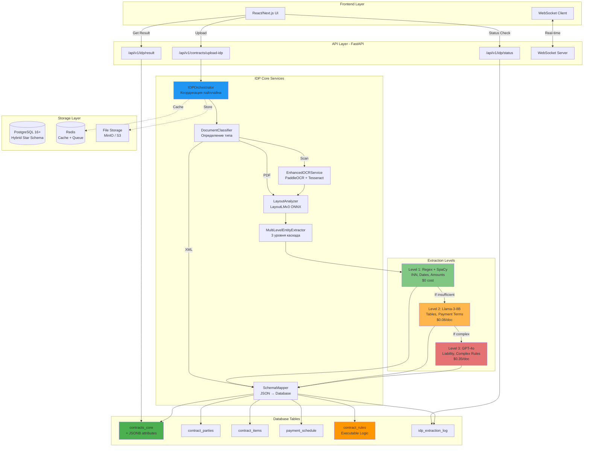
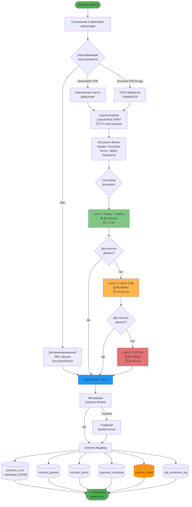
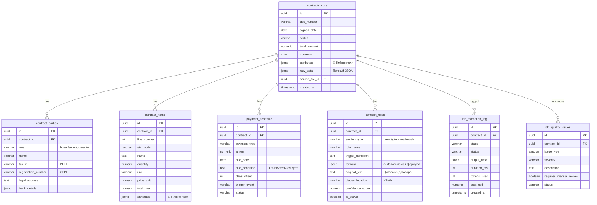
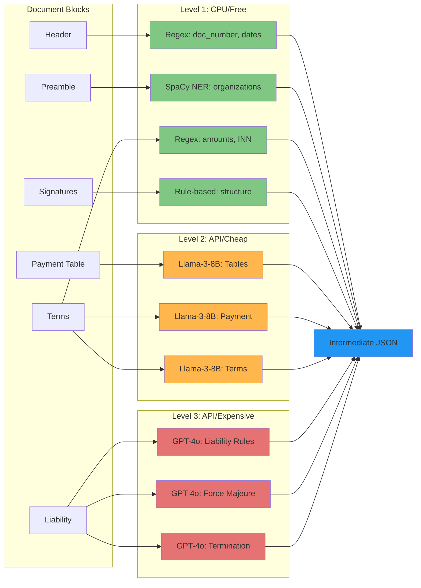
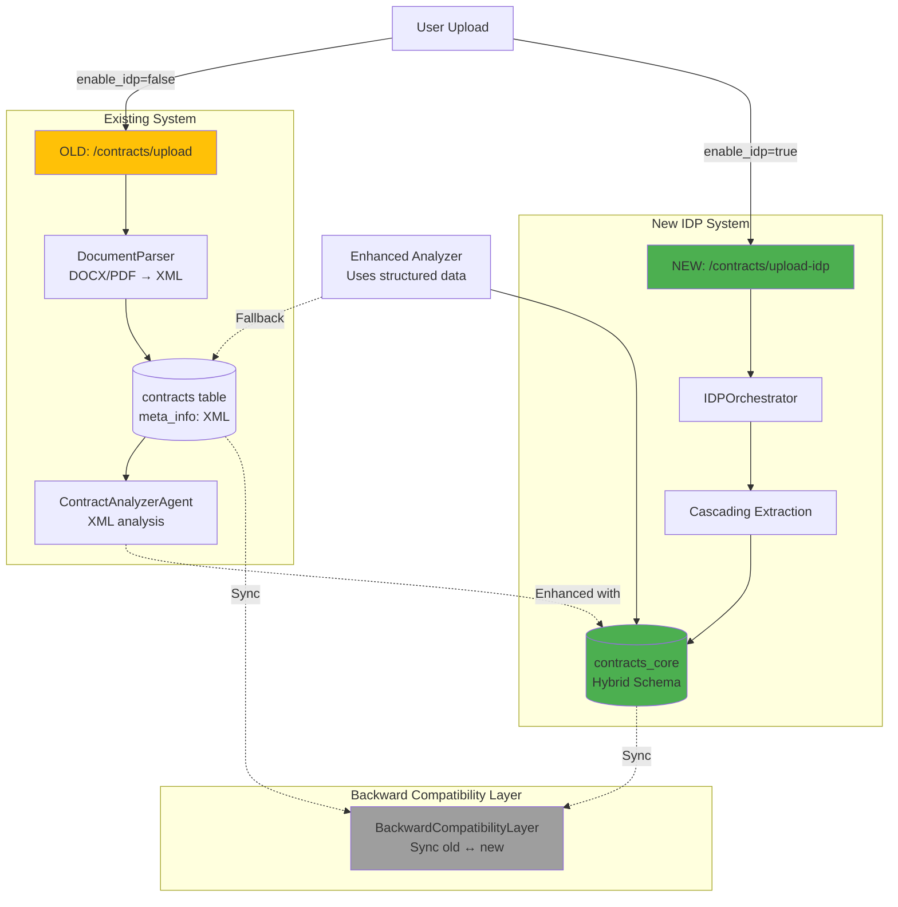
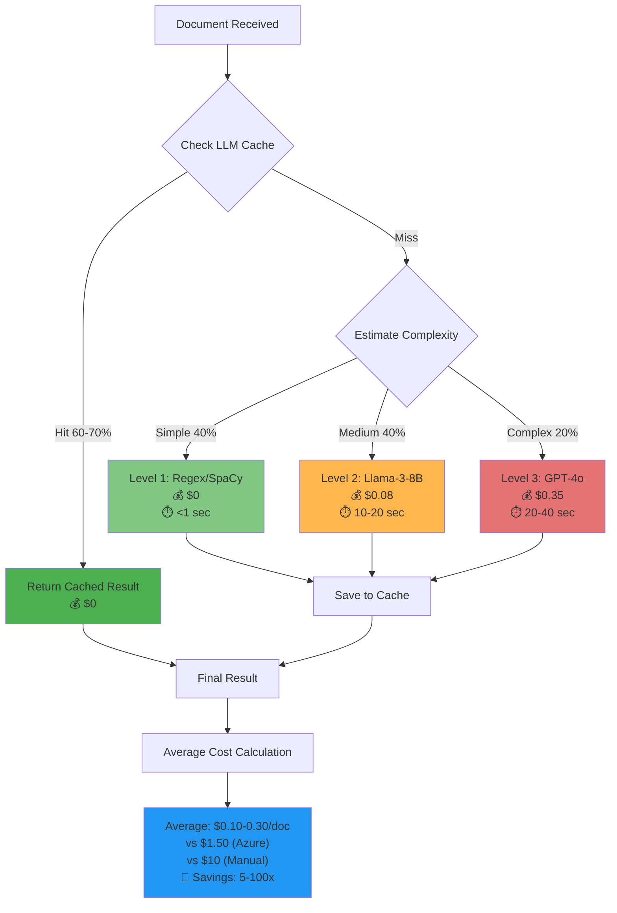
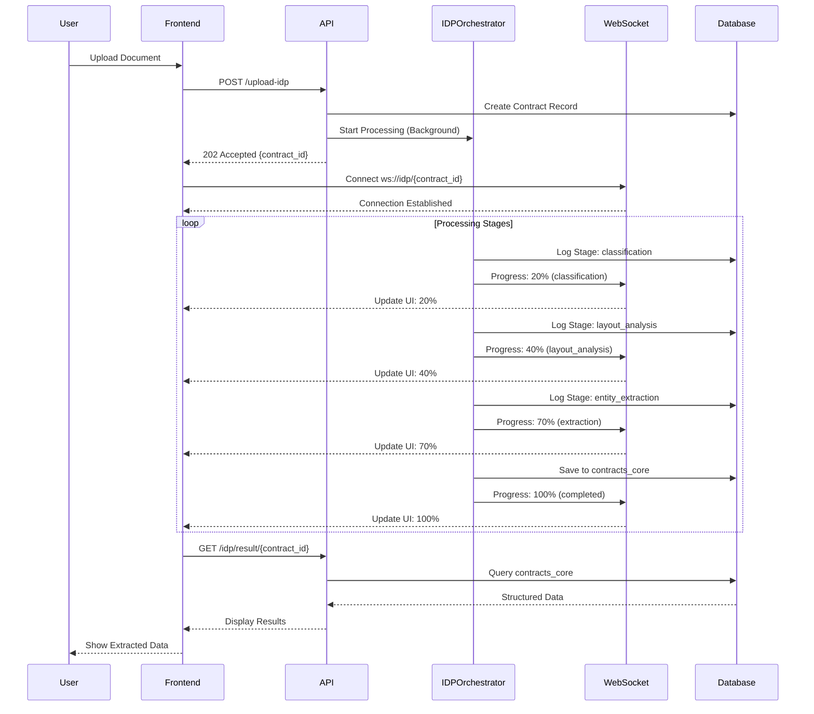
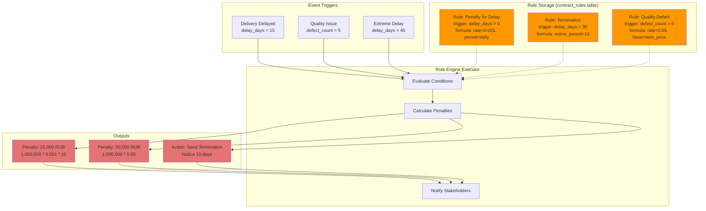
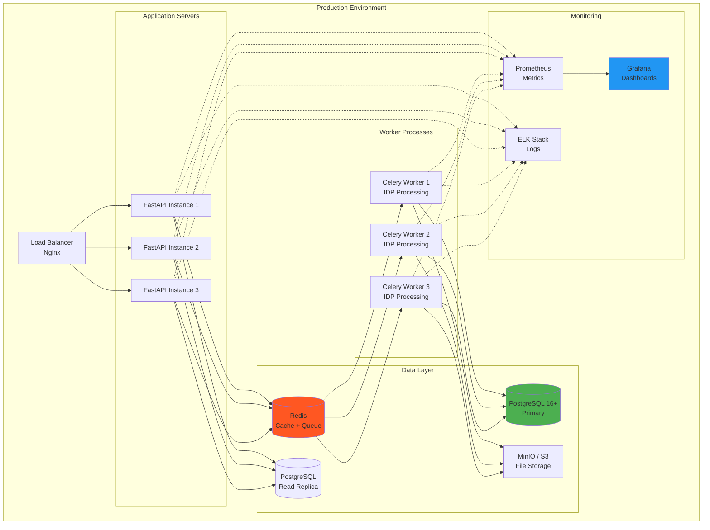
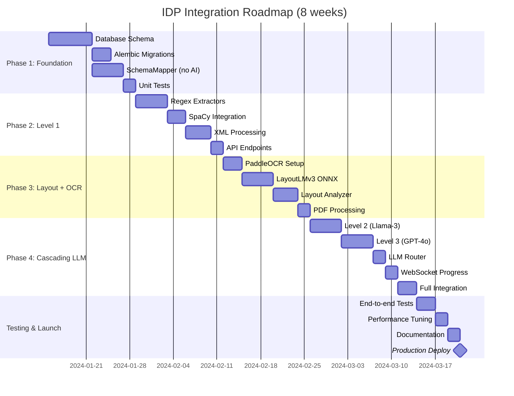

# 🏗️ IDP Architecture Diagrams

## 1. Общая архитектура системы

---

## 2. Пайплайн обработки документа

---

## 3. Hybrid Star Schema (База данных)

---

## 4. Cascading Extraction Strategy

---

## 5. Интеграция с существующей системой

---

## 6. Cost Optimization Strategy

---

## 7. Real-time Progress Tracking

---

## 8. Executable Rules Engine

---

## 9. Deployment Architecture

---

## 10. Phase Rollout Plan

---

**Все диаграммы можно открыть в Mermaid Live Editor:** https://mermaid.live/
